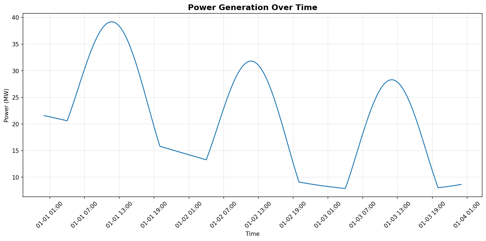
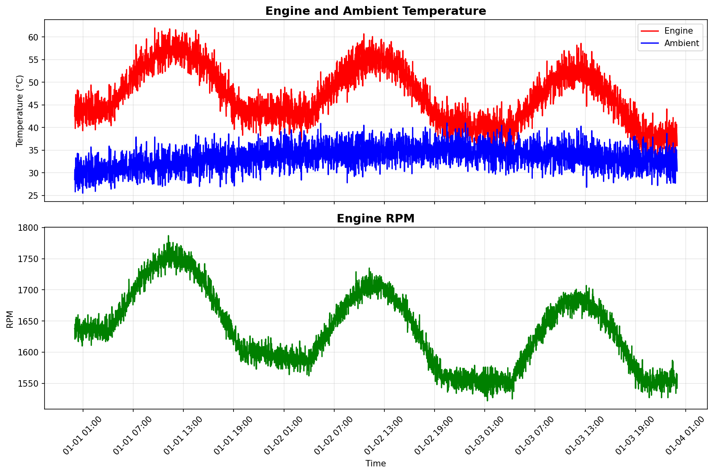

# Telemetry Service

A FastAPI-based service that generates realistic time-series telemetry data for power assets.

## Features

- **Realistic Patterns**: Simulates daily/weekly load cycles with smooth variations
- **Multiple Metrics**: Power generation, fuel consumption, engine metrics, electrical characteristics, battery status, and CO2 emissions
- **Deterministic**: Seeded generation ensures consistent data for the same asset and time range
- **REST API**: Simple HTTP endpoints for retrieving telemetry data

## Quick Start

```bash
# Install dependencies
uv sync

# Run the server
uv run python main.py

# Or with custom port
uv run python main.py --port 8080
```

The API will be available at `http://localhost:8000` with interactive docs at `http://localhost:8000/docs`.

## API Usage

```bash
# Get telemetry for an asset
curl "http://localhost:8000/telemetry/GEN-001?start_time=2024-01-01T00:00:00Z&end_time=2024-01-01T02:00:00Z"

# Health check
curl http://localhost:8000/health
```

## Example Output

The service returns 1-minute interval data with realistic patterns:

```json
[
  {
    "timestamp": "2024-01-01T00:00:00+00:00",
    "asset_id": "GEN-001",
    "power_gen_MW": 45.23,
    "fuel_flow_kg_h": 320.45,
    "engine_load_percent": 75.4,
    "engine_rpm": 1726,
    "engine_temp_C": 68.2,
    "ambient_temp_C": 22.1,
    "voltage_V": 11012,
    "current_A": 2489.3,
    "frequency_Hz": 50.01,
    "battery_soc_percent": 65.4,
    "battery_power_MW": 0.12,
    "co2_emissions_kg_min": 14.289,
    "efficiency_percent": 38.2
  }
]
```

## Telemetry Visualization


*Daily power generation pattern showing typical load variations*


*Engine temperature and RPM correlated with load*

## Implementation Details

- Uses sine waves and exponential distributions for smooth, realistic patterns
- Incorporates daily cycles (higher during day, lower at night)
- Simulates weekend effects (reduced load)
- Models efficiency curves and thermal dynamics
- All metrics are physically consistent with each other